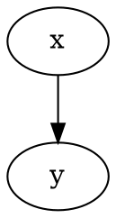
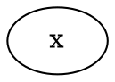
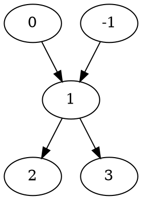
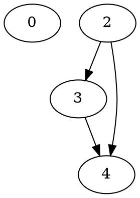
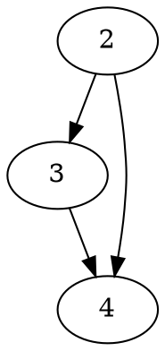
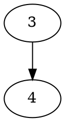

# Topological Sort

## Relation

```typescript
export class Relation {
    m_X: number;
    m_Y: number | null;
}
```

The relation is in the form of $x<y$, which means "x precedes y". 



When $y$ is null, it means that $x$ has no successor and predecessor, and we will represent $x<null$ as follows:



## Relation Info

```typescript
export class RelationInfo {
    m_DirectPredecessorsCount: number;
    m_DirectSuccessors: Array<number>;
}
```

We want to process relation and get most out of it. For each number, we will associate a relation info with it.



For example, if we have $1<2$,$1<3$,$0<1$ and $-1<1$, then the info associated with $1$ would be:

```json
{
    m_DirectPredecessorsCount:2,
    m_DirectSuccessors:[2,3]

}
```

## Sort Algorithm

```typescript
export class TopologicalSort {
    m_RelationsInfo: Map<number, RelationInfo>;
    m_OutputQueue: Array<number>;
    m_Output: Array<number>;
}
```

```typescript
<TopologicalSort /> +
    function Sort(this: TopologicalSort) {
        while (this.m_OutputQueue.length !== 0) {
            <AddToOutput />;
            <EraseRelations />;
        }
        return this.m_Output;
    };
```

In this algo, we will maintain an output queue. For example, if we have relations $0<null$, $2<3$, $2<4$ and $3<4$.



We want to at first pick up all numbers that has no predecessor. As it's obvious that we can arrange them first so that there won't be any conflict.

For example, initially, $0$ and $2$ will be added to output queue.

### Dequeue

```typescript
function AddToOutput(this: TopologicalSort) {
    const front = this.m_OutputQueue.shift();
    this.m_Output.push(front);
}
```

We can safely dequeue an number and add it to the final output array, and then erase all relations related to it, since it's already in the finnal output, we can remove it from the diagram.

### Erase Relations

```typescript
function EraseRelations(this: TopologicalSort, front: number) {
    const front_info = this.m_RelationsInfo.get(front);
    front_info.m_DirectSuccessors.forEach(successor => {
        <DecreaseDirectPredecessorsCount />;
        <CheckIfAddToOuputQueue />;
    });
}
```

For example, we remove $0$ from the diagram and get:



then we will remove 2 and get:



at this point, the output array is
```json
[0,2]
```

Then, it's obvious that we can continue to find number that has no predecessor and repeat untill there is no more number in the diagram, that's what ```CheckIfAddToOuputQueue ``` does:

```typescript
function CheckIfAddToOuputQueue(successor_info: RelationInfo, successor: number) {
    if (successor_info.m_DirectPredecessorsCount === 0) {
        this.m_OutputQueue.push(successor);
    }
}
```

### Initialize m_RelationsInfo

As is shown above, ```m_RelationsInfo``` is the essence of this algo, but how to initialize it?

```typescript
<TopologicalSort /> +
    function constructor(this: TopologicalSort, relations: Array<Relation>) {
        <InitializeMember />;
        <InitializeFromRawRelations />;
    };
```

```typescript
function InitializeFromRawRelations(this: TopologicalSort, relations: Array<Relation>) {
    relations.forEach(relation => {
        <EnsureRelationInfoExists />;
        <RecordRelations />;
    });
    <ScanForZeros />;
}
```

For each relation, we will update info related to both $x$ and $y$:

```typescript
function EnsureRelationInfoExists(this: TopologicalSort, relation: Relation) {
    [relation.m_X, relation.m_Y].forEach(value => {
        if (value !== null && !this.m_RelationsInfo.has(value)) {
            this.m_RelationsInfo.set(value, new RelationInfo());
        }
    });
}
```

```typescript
function RecordRelations(this: TopologicalSort, relation: Relation) {
    if (relation.m_Y) {
        const x_info = this.m_RelationsInfo.get(relation.m_X);
        x_info.m_DirectSuccessors.push(relation.m_Y);
        const y_info = this.m_RelationsInfo.get(relation.m_Y);
        y_info.m_DirectPredecessorsCount += 1;
    }
}
```

### Initialize m_OutputQueue

Here zero means "zero predecessor".

```typescript
function ScanForZeros(this: TopologicalSort) {
    this.m_RelationsInfo.forEach((info, key) => {
        if (info.m_DirectPredecessorsCount === 0) {
            this.m_OutputQueue.push(key);
        }
    });
}
```

## Appendix

### Trival Initialization

```typescript
<Relation /> +
    function constructor(this: Relation, x: number, y: number | null) {
        this.m_X = x;
        this.m_Y = y;
    };
```

```typescript
<RelationInfo /> +
    function constructor(this: RelationInfo) {
        this.m_DirectPredecessorsCount = 0;
        this.m_DirectSuccessors = new Array();
    };
```

```typescript
function InitializeMember(this: TopologicalSort) {
    this.m_RelationsInfo = new Map();
    this.m_OutputQueue = new Array();
    this.m_Output = new Array();
}
```

### Trival Implementation

```typescript
function DecreaseDirectPredecessorsCount(this: TopologicalSort, successor: number) {
    const successor_info = this.m_RelationsInfo.get(successor);
    successor_info.m_DirectPredecessorsCount -= 1;
}
```

# Reference

This algo is adapted from TAOCP I 2.2.3.